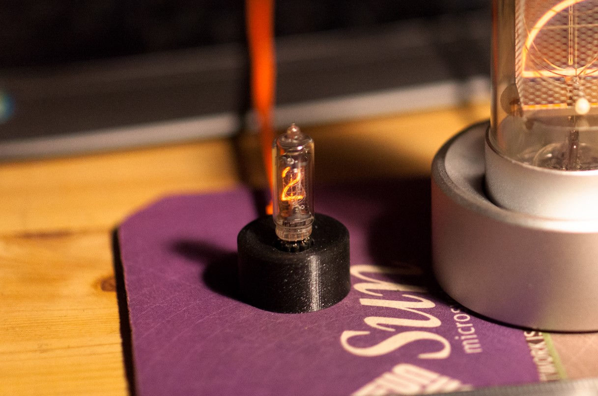

# solo-nixie
A tiny single nixie tube clock, for LD995a or IN-16. USB powered, DS3231 RTC, built-in power-supply.

Details here https://pierremuth.wordpress.com/2021/12/11/a-cute-little-single-tube-nixie-clock/

